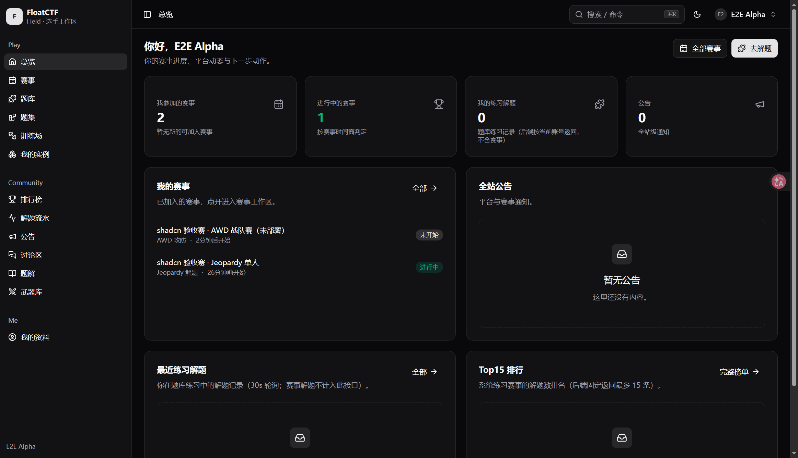
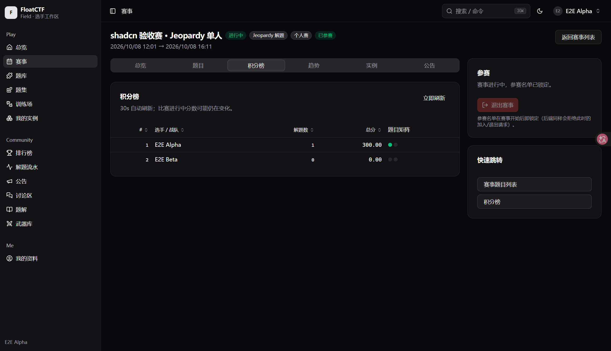
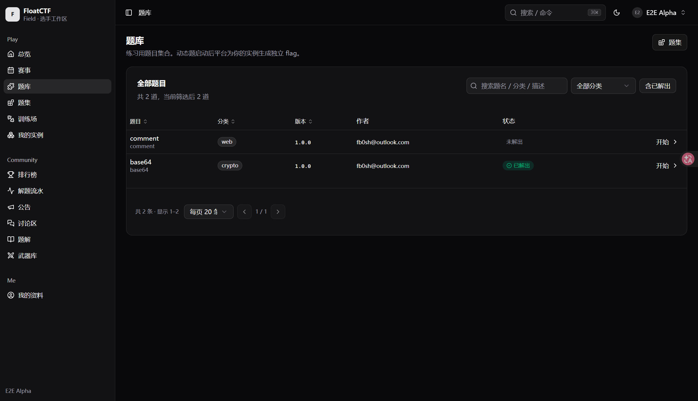
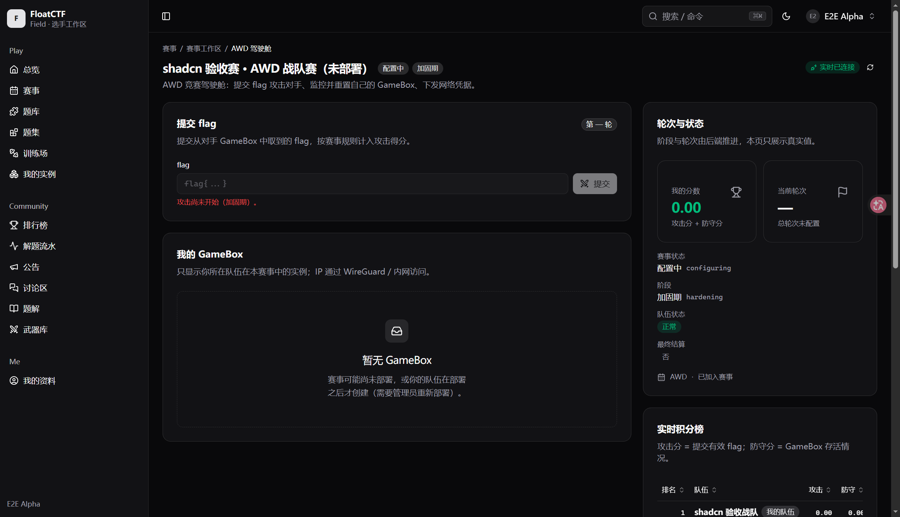
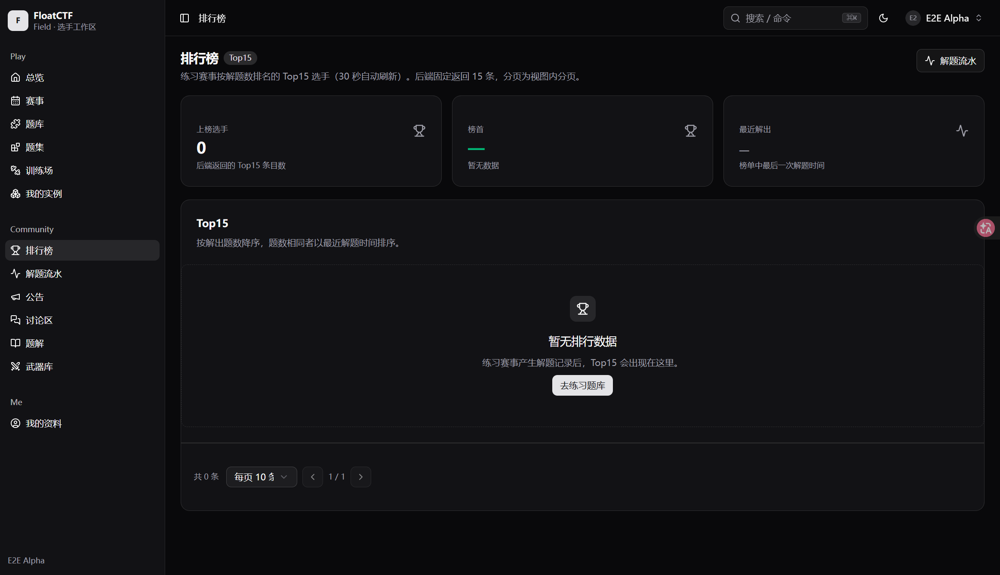
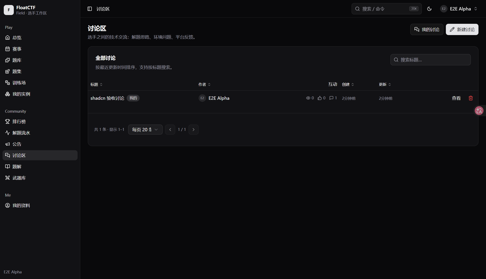
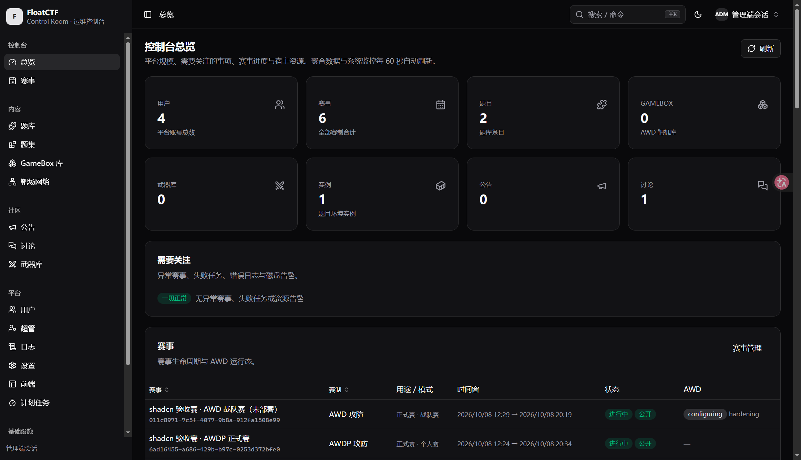
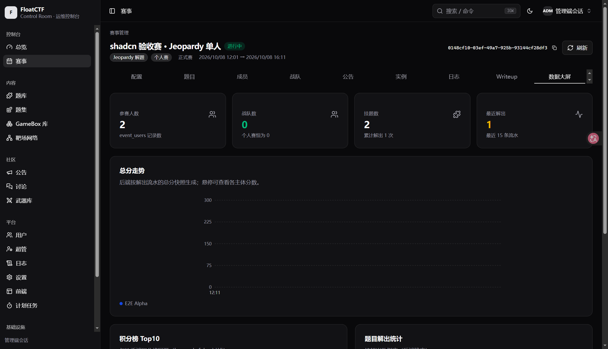
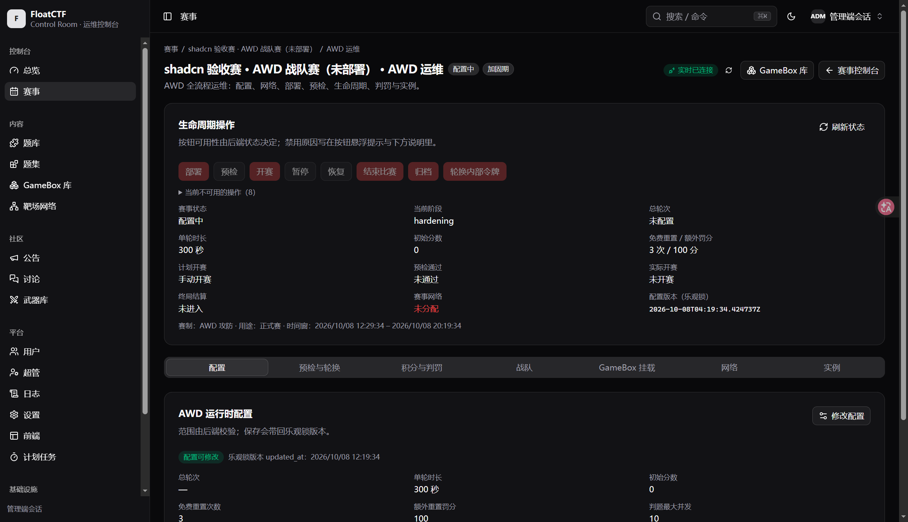

# FloatCTF Shadcn Console（前端 id: `shadcn`）

一个**全新的 FloatCTF 可插拔前端**：不是官方 Default 前端的换皮，而是一套独立的浏览器应用
（自己的路由、设计系统、交互模型与信息架构）。技术底座是 **shadcn/ui**。

- **范围**：`complete` —— 覆盖 [CAPABILITY-MATRIX](../../docs/frontend/CAPABILITY-MATRIX.md)
  中**全部 89 项 `required` 能力**（选手端 + 管理端）；`optional` / `specialized` 也尽量落地，
  逐行状态见 [CAPABILITY-COVERAGE.md](./CAPABILITY-COVERAGE.md)。
- **技术栈**：React 19 · TypeScript 5.7 · Vite 6 · Tailwind CSS v4 · shadcn/ui（Radix + CVA）·
  react-router v7 · TanStack Query v5 · TanStack Table v8 · Zustand v5 · sonner · cmdk ·
  react-markdown + remark-gfm · @xterm/xterm。
- **交互模型**：双工作区（选手端 **Field** / 管理端 **Control Room**）+ 赛事工作区（标签面板）+
  AWD/AWDP 单页驾驶舱 + 全局命令面板（⌘K）+ 移动端底部导航。
- **依赖边界**：只 import `@floatctf/sdk`、`@floatctf/frontend-runtime`、`@floatctf/react` 与第三方库；
  **不** import `frontends/default/*`、`apps/web/*`、`packages/*/src/*`。包内 alias 用 `~/*` → `src/*`
  （`@/*` 是 monorepo 的私有 alias，本前端刻意不使用）。

---

## 0. 这个仓库的两种用法

| 场景 | 依赖如何解析 | 怎么做 |
|---|---|---|
| **作为 FloatCTF monorepo 的 submodule**（推荐） | 位于 `frontends/floatctf-frontend-shadcn`，`@floatctf/*` 走 pnpm workspace 解析到本地包 | 见 §1（monorepo 根 `pnpm install` 后按包过滤运行命令） |
| **独立 checkout**（本仓库单独克隆） | `@floatctf/*` **未发布到 npm**，需按 [AI-FRONTEND-GUIDE §18](../../docs/frontend/AI-FRONTEND-GUIDE.md) 用 release tarball | 见 §1.1 |

> 两种用法共用**同一个** `mount(context)` 制品入口，平台契约不会分叉；
> 差异只在依赖解析方式（`workspace:*` vs `file:` tarball）。

## 1. 快速开始（开发）

本前端是 FloatCTF monorepo 内的 pnpm workspace 成员，`@floatctf/*` 通过 `workspace:*` 解析到本地包。

```bash
# 依赖（在 monorepo 根执行一次）
cd /home/fb0sh/Projects/floatctf && mise exec -- pnpm install

# 类型检查 / 构建（构建产出 dist/ + 经 parseFrontendManifest 自检的 frontend.json）
mise exec -- pnpm --filter @floatctf/frontend-shadcn typecheck
mise exec -- pnpm --filter @floatctf/frontend-shadcn build

# 开发服务器（默认 :13400，自己代理 /api 到开发入口 Caddy :7780）
mise exec -- pnpm --filter @floatctf/frontend-shadcn dev
```

打开 **http://127.0.0.1:13400**（或局域网地址）。

> **dev 路径说明**：`index.html → src/dev.tsx → mount(context)` 直接挂载，与生产
> （`apps/web` bootstrap → 本地注册表 → 版本化 ESM 制品 → 同一个 `mount(context)`）**共用同一入口**，
> 因此契约不会分叉。dev 下 `apiBaseUrl` 仍是同源 `/api`（由 Vite 代理到 `:7780`），
> 不需要为 CORS 改后端配置。

### 1.1 独立 checkout（仓库外构建）

`@floatctf/*` 目前没有发布到 npm registry，因此单独克隆本仓库时先把三个公共包打成 tarball：

```bash
# 1) 在 FloatCTF 主仓库里打包（会先构建 packages/*）
git clone https://github.com/FloatCTF/floatctf /tmp/floatctf && cd /tmp/floatctf
scripts/package-sdk-dist.sh /tmp/floatctf-dist
( cd /tmp/floatctf-dist && sha256sum -c SDK-SHA256SUMS )

# 2) 在本仓库安装（注意用 npm：未发布包之间的 pnpm 解析会 404）
npm install /tmp/floatctf-dist/floatctf-sdk-1.0.0.tgz \
            /tmp/floatctf-dist/floatctf-frontend-runtime-1.0.0.tgz \
            /tmp/floatctf-dist/floatctf-react-1.0.0.tgz
npm install react@^19 react-dom@^19 @tanstack/react-query@^5
# 3) 把 package.json 里的 "workspace:*" 换成对应版本（或 file:/tmp/floatctf-dist/*.tgz）
npm run build          # vite build && tsc --noEmit
```

> 本仓库的 `docs/` 里有若干指向主仓库 `docs/frontend/*` 的相对链接：作为 submodule 时有效，
> 单独克隆时请到主仓库阅读对应文档。

## 2. 安装到 FloatCTF 实例

```bash
cd /home/fb0sh/Projects/floatctf/frontends/floatctf-frontend-shadcn
mise exec -- pnpm build
tar -czf /tmp/shadcn-0.1.0.tar.gz -C dist .

cd /home/fb0sh/Projects/floatctf
./scripts/frontend.sh verify /tmp/shadcn-0.1.0.tar.gz          # 制品 / manifest / 兼容性校验
sudo $FLOATCTF_HOME/frontend.sh install /tmp/shadcn-0.1.0.tar.gz
sudo $FLOATCTF_HOME/frontend.sh list
sudo $FLOATCTF_HOME/frontend.sh info shadcn
```

**激活**：管理端 → 平台 → 设置 → `FRONTEND_ACTIVE` 选择 `shadcn`（或把该设置的值写成 `shadcn`）。
CLI **不会**替你激活。**破窗恢复**：任意页面加 `?frontend=default` 即可回到官方前端，且不改动设置。

## 3. 两条加载路径都验证过

| 路径 | 方式 | 结果 |
|---|---|---|
| 开发直挂 | `pnpm dev` → `http://<lan>:13400`，`dev.tsx` 直接 `mount(context)` | ✅ |
| 生产引导链 | 真实 `apps/web/dist` 引导页 → `GET /api/frontend`（`active_frontend`）→ `registry.json` → 版本化制品 → `mount(context)` | ✅ |

引导链验证方式：把 `FRONTEND_ACTIVE` 通过公共管理接口改成 `shadcn`，用同源服务器复刻生产 Caddy 的三条映射
（`/api/**` 反代、`/__floatctf/frontends/**` 提供注册表与版本化资产、其余路径回退引导页 `index.html`），
浏览器实测：`/` 加载本前端登录页；**深链直接刷新**（`/events/<id>?tab=scoreboard`）可用；
`?frontend=default` 回到 Default Frontend 且设置未被修改。详见 [docs/E2E-ACCEPTANCE.md](./docs/E2E-ACCEPTANCE.md)。

## 4. 交互模型（与 Default 无关）

| 维度 | 本前端的做法 |
|---|---|
| 选手端导航 | 左侧可折叠导航（Play / Community / Me）+ 顶栏上下文条 + ⌘K 命令面板 + 移动端底部导航 |
| 赛事 | **一个赛事 = 一个工作区**（`/events/:id`），能力以标签面板呈现：总览 / 题目 / AWD / AWDP / 积分榜 / 趋势 / 实例 / 公告 |
| AWD | 合并进单一**驾驶舱** `/arena/:id`（Default 拆成 overview/gameboxes/scoreboard/wireguard/ssh 五页）：左攻击面板 + 右轮次与实时积分榜 + 网络凭据区 |
| AWDP | 单一工作台 `/lab/:id`：阶段步进 + 我的靶机 + Break/Fix 动作区 + 轮次与评测 + 积分榜/趋势；练习在 `/training/runs/:id` |
| 管理端 | Control Room：聚合总览 + 资源列表 + **Sheet 侧栏表单** + 赛事控制台（标签面板）+ AWD/AWDP 独立运维页 |
| 破坏性操作 | 统一 `AlertDialog`（`useConfirm`），列出**真实后果**；高危操作要求输入确认词；绝不使用原生 `alert/confirm` |
| 实时 | 连接状态胶囊（连接中/已连接/重连中/鉴权失败/已断开）；非连接态自动降级轮询，断线不冻结页面 |
| 移动端 | 表格退化为卡片；侧边栏收进 Sheet；底部导航 |

## 5. 目录结构

```
src/
├── entry.tsx              # 制品入口：manifest + mount(context)
├── dev.tsx                # dev 入口（同一 mount）
├── api/                   # client.ts(装配) / call.ts(信封+上传) / errors.ts / keys.ts
├── auth/store.ts          # 两个独立 token 作用域（user / admin）
├── app/                   # router(自注册收集) / shell / guards / providers / command-palette / nav
├── components/
│   ├── ui/                # shadcn/ui 组件（由 shadcn CLI 生成）
│   └── app/               # 本前端的组合基元：states / page / data-table / confirm / toast /
│                          # form / markdown / badges / charts / user-cell
├── features/              # 按能力切分，每个目录一个 routes.tsx 自注册
│   ├── auth/ dashboard/ events/ jeopardy/ instances/ community/ profile/
│   ├── awd/ awdp/ training/
│   └── admin/{core,events,awd-ops,awdp-ops,community,platform,infra}/
├── lib/                   # utils(cn) / format / hooks / theme / event-status
└── styles/globals.css     # Tailwind v4 + shadcn 主题令牌
```

**新增页面**：在 `src/features/<域>/routes.tsx` 里导出

```tsx
export const feature: FeatureModule = {
	shell: "player",                       // public | player | admin
	routes: [{ path: "/x", element: <XPage /> }],
};
```

`src/app/router.tsx` 用 `import.meta.glob` 自动收集全部 feature 路由并按 shell 分组，
由 `RequireUser` / `RequireAdmin` 守卫统一包裹 —— 新增页面无需改动路由聚合文件。

作业口径（共享组件 API、数据层写法、SDK 陷阱）见 [docs/dev/CONVENTIONS.md](./docs/dev/CONVENTIONS.md)。

## 6. 设计原则（平台级约束）

1. **真实数据**：页面每一条数据都来自后端接口；没有数据就是空态。**没有任何 mock / 占位数据**
   随制品发布（`docs/dev/SDK-SURFACE.md` 是生成的 SDK 速查，不是数据源）。
2. **状态判定与后端一致**：赛事状态用 `lib/event-status.ts`（与后端 `time_status()` 同规则）、
   AWD/AWDP 阶段直接用后端字段（含 `preparing_fix` 过渡态），前端不发明状态。
3. **错误可见**：所有查询经 `QueryState` 渲染 loading / empty / error 三态；错误块给出后端文案、
   状态码与重试入口；绝不白屏。
4. **信封守卫**：平台业务失败是 HTTP 200 + `code !== 0`，SDK 不会 reject；本前端在 transport 上装
   拦截器把它转成 `FloatCTFError` rejection（`src/api/call.ts`），页面因此不会「静默成功」。
5. **凭据安全**：token 只存在本前端的 store（localStorage，异常兜底），**绝不进 URL / query string**；
   SSH 密码、WireGuard 私钥、flag 等敏感值用 `SecretValue` 默认模糊；不渲染 `password` 字段。
6. **可访问性**：全部交互可键盘完成；图标按钮带 `aria-label`；对话框/抽屉用 Radix（自带焦点陷阱与
   `aria-*`）；状态不只靠颜色区分。
7. **资产路径**：一律用 `context.assetBaseUrl` 解析自带资产，绝不硬编码站点根。

## 7. 已知契约观察（供平台维护者）

1. **选手端 `EventInfo` 不返回顶层 `id`**（SDK 类型声明有该字段，运行时为 `undefined`）：
   `GET /events` 与 `GET /events/{id}` 的响应只有 `{ event, team_result, joined }`。
   直接用 `info.id` 会请求 `/events/undefined/...`（实测 400「路径参数格式错误」）。
   本前端统一用 `eventIdOf(info)`（`info.event.id`）。**建议**平台侧补上该字段或修正 SDK 类型。
2. **另外两条类型/响应漂移**（实现在不臆造类型的前提下按真实响应处理）：
   - `discussions.getComments` 声明 `UniResponse<DiscussionComments[]>`，后端实际返回
     `CommentWithAuthor`（`serde flatten` + `author_nickname` / `author_avatar`）；
   - `users.patchMe` 声明 `UniResponse<Users>`，后端 `PATCH /users/me` 实际无 data（`UniResult<()>`），
     因此保存后用本地提交值刷新会话资料并失效 `me` 查询。
3. **逃生舱使用（AI-FRONTEND-GUIDE §5.4，均为 class B，已在代码注释与交付说明中标注）**：
   - 上传进度：`client.transport.*`（axios 级 `onUploadProgress`，领域门面不暴露）；
   - 管理端 Web 终端：`client.adminHttp.post("/terminal/session")` + 原生 `WebSocket`；
   - 前端注册表：同源 `fetch(DEFAULT_REGISTRY_URL)` + `parseRegistry`（注册表是静态文件，不是后端 API）。
4. **赛事模式组合的后端约束**（实测，前端据此决定参与面板形态）：
   `family=awd` 只允许 `participant_mode=team`；`family=awdp` 只允许 `individual`；
   `purpose=practice` 的 AWDP 赛事**不支持** `join/team`（`UnsupportedForPurpose`），
   练习入口走 `/training`（`awdp.runs`），赛事工作台只对 competition 赛事的参赛者开放。
5. 后台刷新语义沿用平台已核实值：积分榜 / 趋势 / 解题流水 / 实例 30s，赛事公告与管理端 dashboard 60s，
   AWD/AWDP 面板由 SSE 驱动（非连接态由 `@floatctf/react` 自动降级轮询）。

## 8. 界面截图

全部截图在**真实 API + 真实播种数据**下采集（见 [docs/E2E-ACCEPTANCE.md](./docs/E2E-ACCEPTANCE.md)），
原图在 [`docs/images/`](./docs/images/)。

### 选手端（Field）

| 总览 | 赛事工作区 · 积分榜 | 题库 |
| :--: | :--: | :--: |
|  |  |  |

| AWD 驾驶舱 | 排行榜 | 讨论区 |
| :--: | :--: | :--: |
|  |  |  |

### 管理端（Control Room）

| 控制台总览 | 赛事控制台 · 数据大屏 | AWD 运维 |
| :--: | :--: | :--: |
|  |  |  |

> 截图均取自**真实 API**。刻意**不放**宿主 Docker 容器清单（容器名 / 镜像 / 端口属运维内部信息，
> 与 Default 前端截图的处理口径一致）与含真实 flag 明文的管理页。

## 9. 交付时记录的公共契约缺口（只报告，未改后端/平台包）

| # | 缺口 | 影响 | 本前端的处置 |
|---|---|---|---|
| 1 | 选手端 `EventInfo` 不返回顶层 `id` | 直接用会让请求打到 `/events/undefined/...` | `eventIdOf(info)` 统一取 `event.id` |
| 2 | `discussions.getComments` 声明 `DiscussionComments[]`，实际是 `CommentWithAuthor` | 评论区作者名拿不到 | 按真实 DTO 读取 |
| 3 | `users.patchMe` 声明返回 `Users`，实际无 data | 保存后拿不到最新资料 | `callVoid` + 本地更新 + 失效 `me` |
| 4 | `awd.admin.precheck` 声明 `string`，实际返回对象（`run_id/status/error_msg/failed_checks/checks`） | 预检结果无法展示 | 按真实对象解析 |
| 5 | `AwdEventConfigInput/AwdEventStatus` 缺 `judge_grace_period_secs` | 该字段无法编辑 | 只读展示 |
| 6 | `AwdpAdminInstanceDto` 缺 `reset_count` | — | 类型保护读取展示 |
| 7 | `settings.fetch` 无参数；`weapons.fetch` 忽略参数且无 meta；`super_admin.fetch` 无 filter；Docker 实为 `offset/limit` 且无 filter | 这些列表无法服务端搜索/分页 | 客户端搜索分页，并在页面上写明 |
| 8 | `scheduled_tasks.payload` 声明 `string` 实为 JSON 值；`timeout_secs` 声明 `string` 实为 number | 无法在不使用 `any` 的前提下提交对象 payload | payload 只读展示 |
| 9 | `AWD_ADMIN_QUERY_KEYS` 不含 event-gameboxes / event-network；管理端无 AWDP SSE（矩阵第 204 行「可用管理端 AWD 流」不成立） | 这两块不随 SSE 刷新 | 手动刷新时补失效；AWDP 管理页用 30s 轮询 |
| 10 | `updateEventGamebox` 的可空判题字段后端缺 `deserialize_nullable`：显式 `null` 被静默忽略 | 「清空」语义不成立 | 表单禁止清空并写明 |

> `PUBLIC SDK GAP` 均属**类型/契约漂移或服务端参数缺失**，全部可用公共面安全实现，
> 因此本前端 **complete 判定不受影响**；未修改任何后端或平台包。

## 10. 许可

AGPL-3.0-only（与平台一致）。
